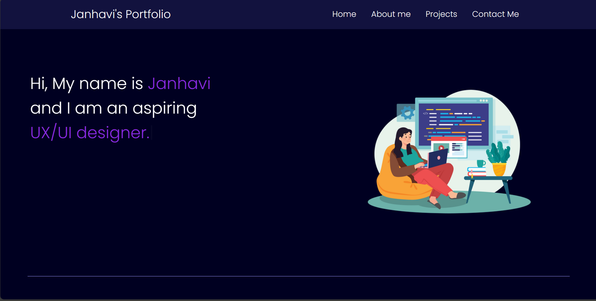
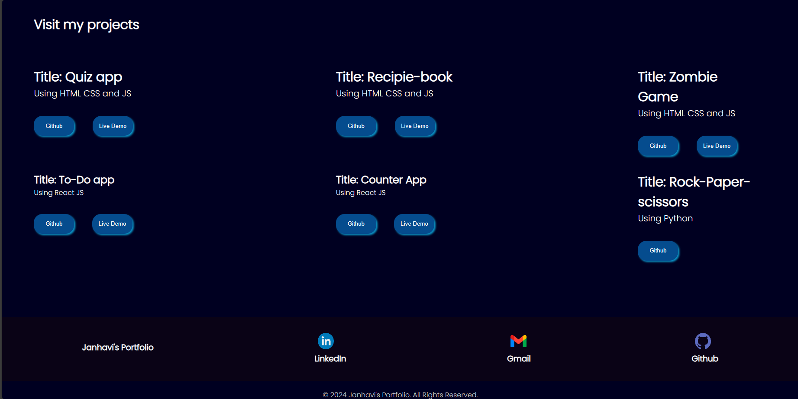

# CodSoft Internship

<b>LEVEL1 :</b>

<b>Task2: Portfolio</b>

I have created my portfolio using HTML, CSS and Javascript. 
I have added header section with name and logo/image.
Also there is a About Section: with my image and bio highlighting my skills and experience.
I have also added Projects Section: Showcase samples of my work or projects.
The Contact Section includes my contact information, such as email address, linkedIn and Github address.
Footer section includes a copyright notice.
Screenshots for the Page:

<i>Caption: Home for Portfolio</i>

<i>Caption: About me section for Portfolio</i>

<i>Caption: Projects and contact me for Portfolio</i>
